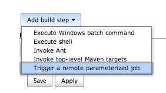
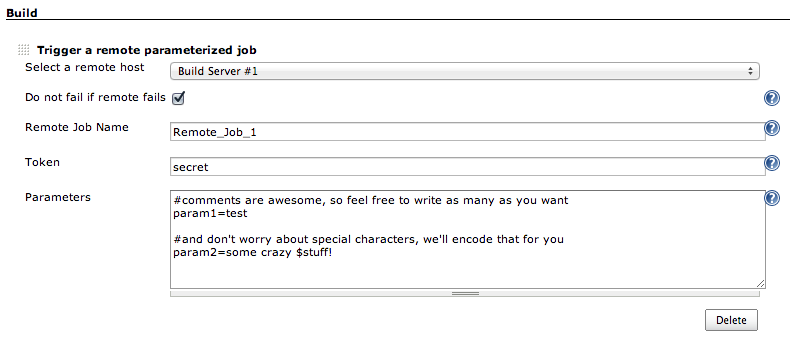
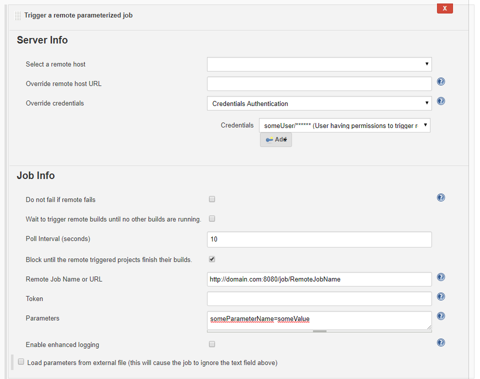

# Job setup options

Select `Build` > `Add build step` > `Trigger a remote parameterized job`

You can select a globally configured remote server and only specify a job name here.
The full URL is calculated based on the remote server, the authentication is taken from the global configuration.
However it is possible to override the Jenkins base URL (or set the full Job URL) and override credentials used for authentication.

You can also specify the full job URL and use only the authentication from the global configuration or specify the authentication per job.

# Support of Folders on Remote Jenkins
[See here for more information](README_PipelineConfiguration.md#user-content-folders)
