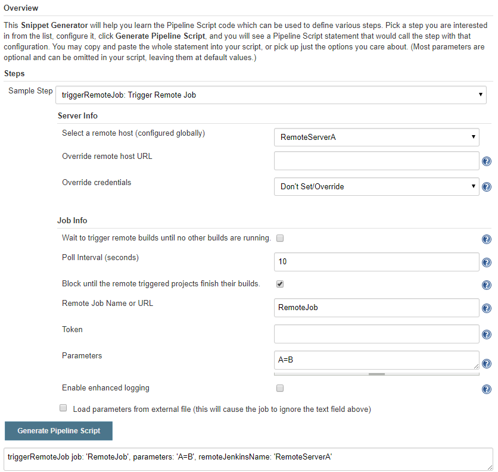
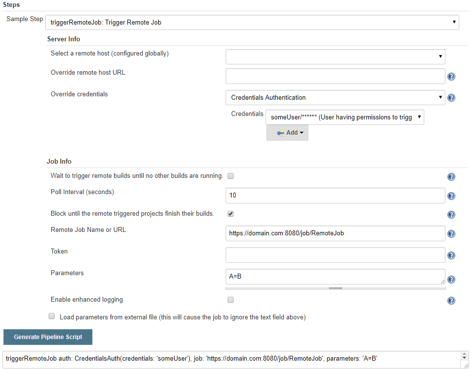

# Pipeline setup options

- [Defaults](#user-content-defaults)
- [Remote Server Configuration](#user-content-server)
- [Authentication](#user-content-authentication)
- [The Handle Object](#user-content-handle)
- [Blocking vs. Non-Blocking](#user-content-blockingnonblocking)
  - [Blocking usage (recommended)](#user-content-blocking)
  - [Non-blocking usage](#user-content-nonblocking)
- [Support of Folders on Remote Jenkins](#user-content-folders)

The `triggerRemoteJob` pipeline step triggers a job on a remote Jenkins. This command is also available in the Jenkins Pipeline Syntax Generator:

You can select a globally configured remote server and only specify a job name here.
The full URL is calculated based on the remote server, the authentication is taken from the global configuration.
However it is possible to override the Jenkins base URL (or set the full Job URL) and override credentials used for authentication.



You can also specify the full job URL and use only the authentication from the global configuration or specify the authentication per job.




<div id="defaults"/>

## Defaults
The simplest way to trigger a job is:
```
def handle = triggerRemoteJob job: 'https://myjenkins:8080/job/JobWithoutParams'
echo 'Remote Status: ' + handle.getBuildStatus().toString()
```

If the job has parameters:
```
def handle = triggerRemoteJob job: 'https://myjenkins:8080/job/JobWithParams', parameters: 'param1=abc\nparam2=xyz'
```

If authentication is required:
```
def handle = triggerRemoteJob job: 'https://myjenkins:8080/job/JobWithoutParams', auth: TokenAuth(apiToken: '<theApiToken>', userName: '<userName>')
```


The pipeline will wait/block until the remote build finished.


<div id="server"/>

## Remote Server Configuration

:information_source: You can configure jobs/pipelines also without any global configuration.

The remote Jenkins server containing the target job(s) can be configured in different ways.
- **Jenkins System Configuration**<br>
  Remote servers can be configured in the [Jenkins System Configuration](README_SystemConfiguration.md) and referenced in Pipelines by their name. The server configuration can also include authentication settings.<br>
  `triggerRemoteJob remoteJenkinsName: 'remoteJenkins' ...`
- **Override Server URL**<br>
  On Pipeline level the URL can be set/overridden with parameter `remoteJenkinsUrl`.<br>
  `triggerRemoteJob remoteJenkinsUrl: 'https://myjenkins:8080' ...`<br>
  If combined with `remoteJenkinsName` only the URL of the globally configured server will be overridden, the other settings like authentication will be used from the global configuration.<br>
  `triggerRemoteJob remoteJenkinsName: 'remoteJenkins', remoteJenkinsUrl: 'https://myjenkins:8080' ...`<br>
- **Full Job URL**<br>
  It is also possible to configure the full job URL instead of the job name only and the remote Jenkins server root URL.<br>
  `triggerRemoteJob job: 'https://myjenkins:8080/job/MyJob' ...`<br>

:information_source: If the remote Jenkins uses folders please [read this](#user-content-folders).

<div id="authentication"/>

## Authentication
Authentication can be configured globally in the system configuration or set/overridden for each pipeline via the `auth` parameter.

The following authentication types are available:
- **Token Authentication** The specified user id and Jenkins API token is used.<br>
  ```auth: TokenAuth(apiToken: '<theApiToken>', userName: '<userName>')```
- **Credentials Authentication** The specified Jenkins Credentials are used. This can be either user/password or user/API Token.<br>
  ```auth: CredentialsAuth(credentials: '<credentialId>')```
- **No Authentication** No Authorization header will be sent, independent of the global 'remote host' settings.<br>
  ```auth: NoneAuth()```

**Note:** *Jenkins API Tokens* are recommended since, if stolen, they allow access only to a specific Jenkins
while user and password typically provide access to many systems.


<div id="handle"/>

## The Handle Object
The `Handle` object provides the following methods:

- `String getJobName()` returns the remote job name
- `URL getBuildUrl()` returns the remote build URL including the build number
- `int getBuildNumber()` returns the remote build number
- `RemoteBuildInfo getBuildInfo()` return information regarding the current remote build
- `RemoteBuildStatus getBuildStatus()` returns the current remote build status
- `Result getBuildResult()` return the result of the remote build
- `BuildStatus getBuildStatusBlocking()` waits for completion and returns the build result
- `boolean isFinished()` true if the remote build finished
- `boolean isQueued()` true if the job is queued but not yet running
- `String toString()`
- `Object readJsonFileFromBuildArchive(String filename)`<br>
    This is a convenience method to download and parse the specified JSON file (filename or relative path) from the build archive.
    This mechanism might be used by remote builds to provide return parameters.

```
def handle = triggerRemoteJob blockBuildUntilComplete: true, ...
def results = handle.readJsonFileFromBuildArchive('build-results.json')
echo results.urlToTestResults //just an example
```

- Enum of RemoteBuildStatus may have the values: `UNKNOWN`, `NOT_STARTED`, `QUEUED`, `RUNNING`, if the remote job did not finish yet.
- Enum of Result may have the values: `ABORTED`, `FAILURE`, `NOT_BUILT`, `SUCCESS`, `UNSTABLE`, if the remote job finished the status reflects the Jenkins build `Result`.


<div id="blockingnonblocking"/>

## Blocking vs. Non-Blocking
The `triggerRemoteJob` command always returns a [`Handle`](#user-content-the-handle-object) object. This object can be used to track the status of the remote build (instead of using the environment variables like in the Job case).

There are two ways to use the command, in a blocking way (it will wait/block until the remote job finished) and in a non-blocking way (the handle is returned immediately and the remote status can be checked asynchronously).

<div id="blocking"/>

### Blocking usage (recommended)
The recommended way to trigger jobs is in a blocking way. Set `blockBuildUntilComplete: true` to let the plugin wait
until the remote build finished:
```
def handle = triggerRemoteJob(
    remoteJenkinsName: 'remoteJenkins',
    job: 'TheJob',
    parameters: 'a=b',
    blockBuildUntilComplete: true,
    ...)
echo 'Remote Status: ' + handle.getBuildStatus().toString()
```

<div id="nonblocking"/>

### Non-blocking usage
It is also possible to use it in a non-blocking way. Set `blockBuildUntilComplete: false` and the plugin directly
returns the `handle` for further tracking the status:
```
def handle = triggerRemoteJob(
    remoteJenkinsName: 'remoteJenkins',
    job: 'TheJob',
    parameters: 'a=b',
    blockBuildUntilComplete: false,
    ...)
while( !handle.isFinished() ) {
    echo 'Current Status: ' + handle.getBuildStatus().toString();
    sleep 5
}
echo handle.getBuildStatus().toString();
```

Even with `blockBuildUntilComplete: false` it is possible to wait synchronously until the remote job finished:
```
def handle = triggerRemoteJob blockBuildUntilComplete: false, ...
def status = handle.getBuildStatusBlocking()
``` 

:warning: Currently the plugin cannot log to the pipeline log directly if used in non-blocking mode. As workaround you can use `handle.lastLog()` after each command to get the log entries.


<div id="folders"/>

# Support of Folders on Remote Jenkins

The Parameterized Remote Trigger plugin also supports the use of folders on the remote Jenkins server, for example if it uses the [`CloudBees Folders Plugin`](https://wiki.jenkins.io/display/JENKINS/CloudBees+Folders+Plugin) or the [`GitHub Branch Source Plugin`](https://plugins.jenkins.io/github-branch-source) (formerly [`GitHub Organization Folder Plugin`](https://wiki.jenkins.io/display/JENKINS/GitHub+Organization+Folder+Plugin))

Remote URLs with folders look like this
```
https://server:8080/job/Folder1/job/Folder2/job/TheJob
```

Without folders it would only be `https://server:8080/job/TheJob`

To be able to trigger such jobs you have to either
1. Specify the full Job URL as `Remote Job Name or URL`
2. Specify the job fullname as `Remote Job Name or URL` + a globally configured [`Remote Host`](#user-content-server).<br>
   The jobs fullname in the example above would be 'Folder1/Folder2/TheJob'.


<br><br><br><br><br><br><br><br><br><br><br><br><br><br><br><br><br><br><br><br><br><br><br><br><br><br><br><br><br><br><br>
