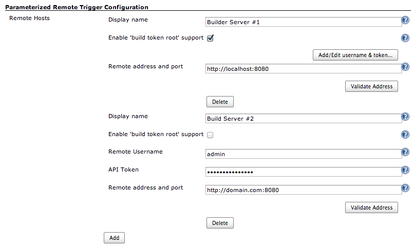

# System configuration options

The Parameterized Remote Trigger plugin can used without any global Jenkins system configuration.

However it might be useful to configure one or more remote server & credentials globally.
From a job/pipeline this server can be referenced together with the job name, without the need to specify the full URL and authentication credentials. Still it is possible to specify or override each part on job/pipeline level.

